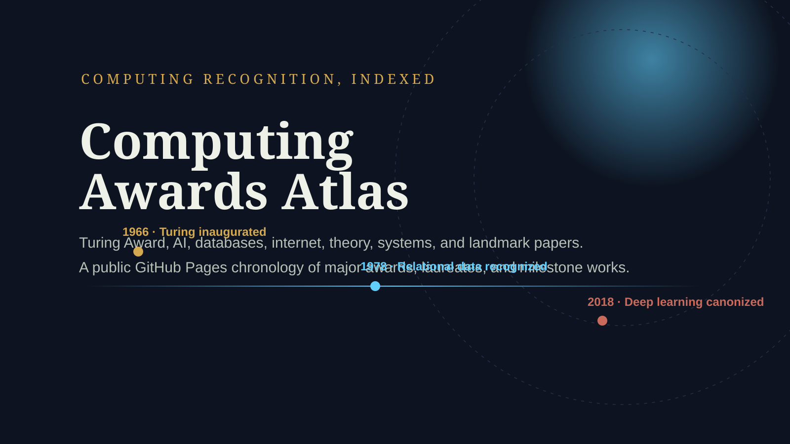

# Computing Awards Atlas 🏆

<!-- markdownlint-disable MD033 -->
<picture>
  
</picture>
<!-- markdownlint-enable MD033 -->

[](#github-pages)
[](#stack)
[](#data-model)
[](LICENSE)
[](https://buy.stripe.com/8x200i8bSgVe3Vl3g8bfO00)

> Public editorial atlas for major computing awards, laureates, milestone papers, books, and historical recognition across computer science.

**Maintainer**

- GitHub: [@dmoliveira](https://github.com/dmoliveira)
- LinkedIn: [Diego Marinho de Oliveira](https://www.linkedin.com/in/dmoliveira/)
- Support: [Stripe donation](https://buy.stripe.com/8x200i8bSgVe3Vl3g8bfO00)

## Why this project exists ✨

Computing history is fragmented across award pages, conference sites, institutional archives, and paper portals. This project creates a single searchable, sortable, GitHub Pages-friendly atlas to help people answer:

- Who won what, and when?
- Which awards matter across AI, systems, databases, IR, networking, theory, and software?
- Which papers, books, and articles best contextualize those recognitions?

## Current MVP scope 🚀

- Premium landing page with dark editorial layout.
- Client-side search across people, awards, topics, institutions, and years.
- Sortable cards/table explorer for award events.
- JSONL authoring pipeline with static JSON output for GitHub Pages.
- SEO-ready metadata and `WebSite` search structured data.
- Expandable sample covering:
  - ACM A.M. Turing Award
  - ACM Prize in Computing
  - Grace Murray Hopper Award
  - Gödel Prize
  - Knuth Prize
  - IEEE John von Neumann Medal
  - Kanellakis Award
  - SIGIR / VLDB / ICDE impact-paper programs
  - IJCAI / AAAI AI recognition programs

## What comes next 🧭

- Full recipient coverage for the main awards.
- More conference 10-year and test-of-time awards.
- Dedicated people pages and award pages.
- Stronger provenance/source notes.
- richer field taxonomy across subfields and institutions.

## Stack 🧱

- **Next.js** static export for GitHub Pages.
- **TypeScript** for app and data tooling.
- **Fuse.js** for in-memory smart search.
- **JSONL** as the editable source of truth.
- Static JSON build artifacts for deployment.

## Data model 📚

Why JSONL first instead of SQLite?

- easier diff review in git
- easier bulk append/import workflows
- simple static-site build step
- portable toward later normalization pipelines

Authoring files:

- `data/awards.jsonl`
- `data/events.jsonl`

Generated outputs:

- `src/generated/awards-atlas.generated.json`
- `public/data/awards-atlas.json`

## Local development 💻

```bash
npm install --yes
npm run dev
```

## Validation ✅

```bash
npm run validate
```

This runs:

- data build
- Next.js production build
- TypeScript checks
- ESLint
- small dataset regression test

## GitHub Pages 🌐

This repo is set up for static Pages deployment via `.github/workflows/deploy-pages.yml`.

For repository publishing, set:

- `PAGES_BASE_PATH=/your-repo-name`
- optional `NEXT_PUBLIC_SITE_URL=https://your-user.github.io/your-repo-name`

The workflow automatically uses the current repository name as the base path during GitHub Actions builds.

## Design notes 🎨

The visual system follows the repo design brief and concept spec under:

- `docs/specs/awards-atlas-design-brief.md`
- `docs/specs/awards-atlas-landing-page-concept.md`

I attempted to use the repo-local `/image` workflow via Codex as requested, but the image runtime is unavailable from this shell session; the current hero/banner and UI were implemented from the generated `/ox-design` concept spec and are ready for future image-assisted refinement.

## Support open source 💛

If this atlas is useful for research, teaching, or public knowledge work:

- [Donate via Stripe](https://buy.stripe.com/8x200i8bSgVe3Vl3g8bfO00)
- [Sponsor on GitHub](https://github.com/sponsors/dmoliveira)
